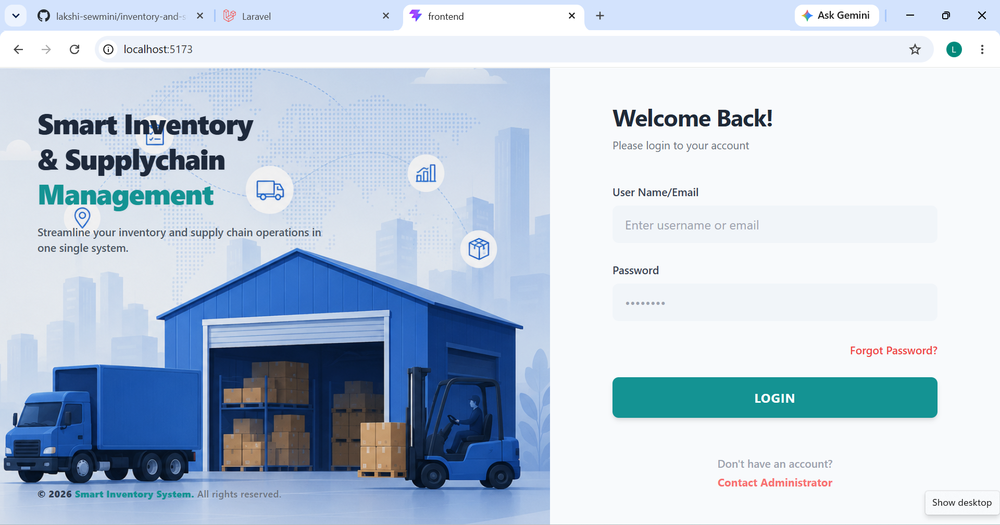
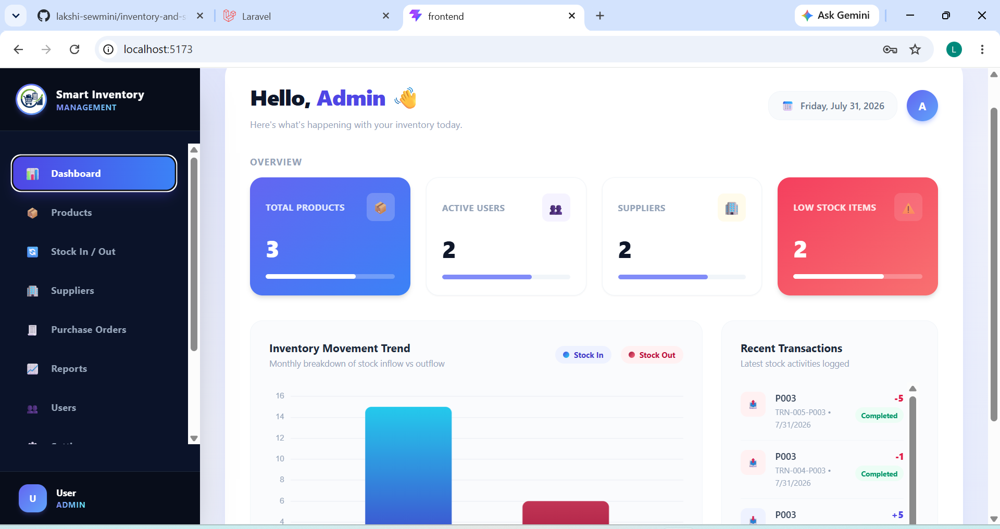
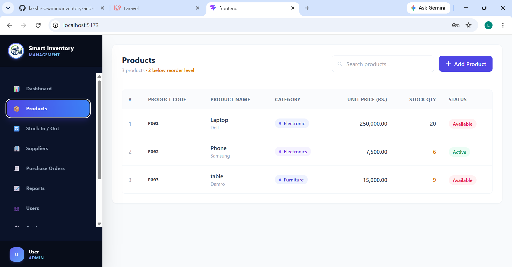
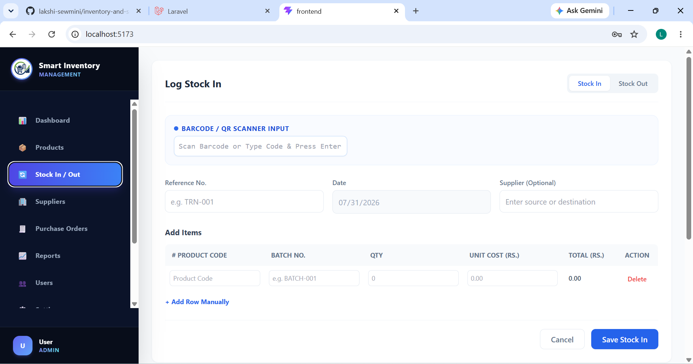
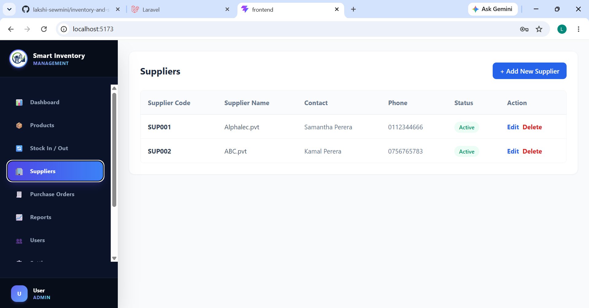
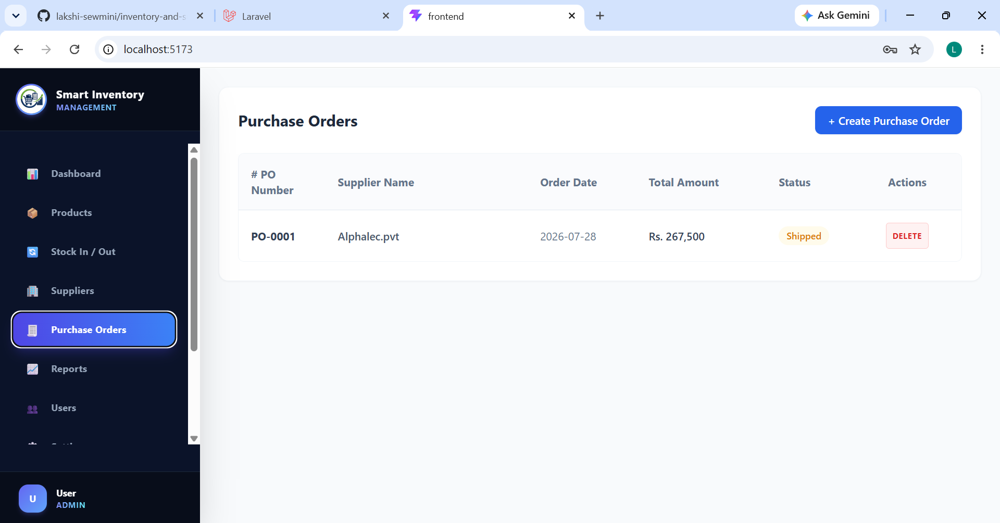
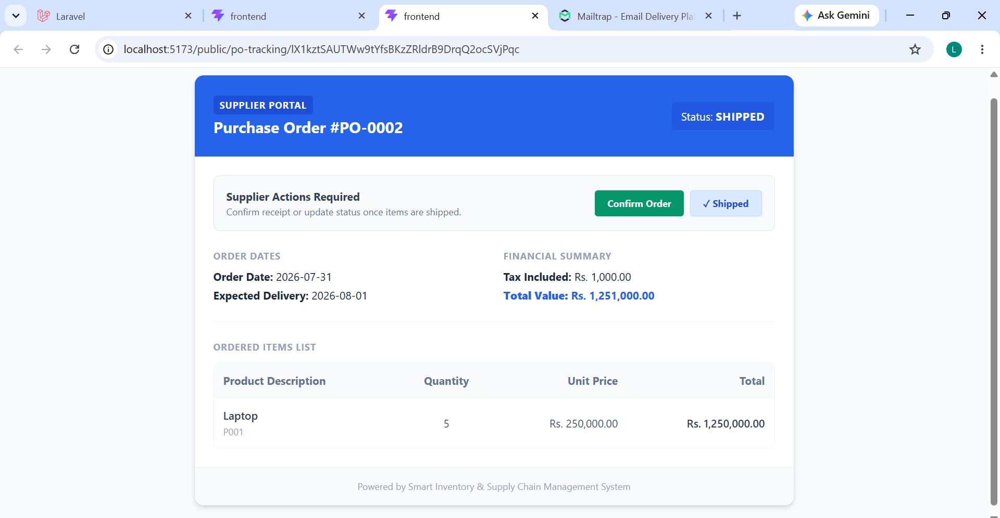
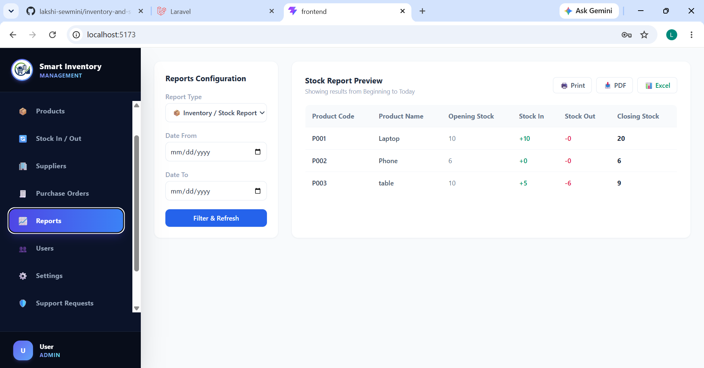
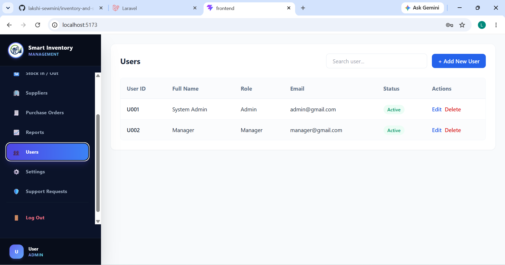
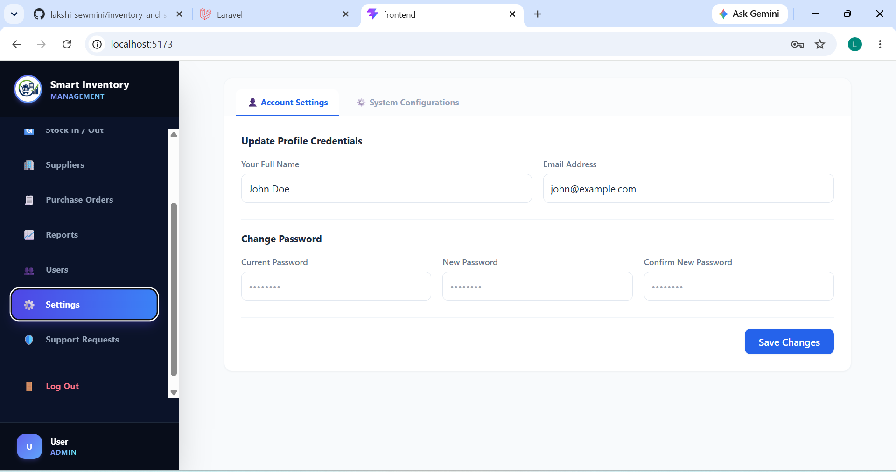

# 📦 Smart Inventory & Supply Chain Management System

A comprehensive web-based inventory and supply chain management system built to streamline stock operations, supplier management, purchase orders, and real-time tracking.

## 🚀 Tech Stack & Tools

* **Frontend:** React.js, Vite, Tailwind CSS / Custom CSS
* **Backend:** Laravel (PHP REST API)
* **Database:** MySQL
* **API Testing:** Postman (For testing REST endpoints and authentication workflows)
* **UI/UX Design:** Figma (For wireframing, UI prototyping, and layout designs)
* **Libraries & Services:** Axios, Chart.js (for analytics), Mailtrap (for email notifications)

---

## ✨ Key Features

* **🔐 Authentication & User Management:** Role-based access control (Admin, Manager, etc.) with secure login and profile settings.
* **📊 Dashboard:** Real-time overview showing total products, active users, suppliers, low stock items, and inventory movement trend charts.
* **📦 Product Management:** Add, update, view, and monitor products with reorder levels and stock status indicators.
* **📥 Stock In / Out Management:** Log incoming and outgoing stock easily using barcode/QR code inputs or manual row additions.
* **🤝 Supplier Management:** Maintain supplier details, contact info, and track active business relationships.
* **📋 Purchase Orders (PO):** Create, track, and manage purchase orders with automated status updates and supplier portal integration.
* **📈 Reports & Analytics:** Generate, filter, and export comprehensive stock reports (Print, PDF, Excel).
* **⚙️ Settings:** Update profile credentials and system configurations.

---

## 📸 Screenshots

### 1. Login Page


### 2. Dashboard


### 3. Product Management


### 4. Stock In / Out


### 5. Suppliers


### 6. Purchase Orders


### 7. Supplier Portal (External View)


### 8. Reports & Analytics


### 9. User Management


### 10. Settings


---

## ⚙️ Installation & Setup

Follow these steps to set up the project locally on your machine.

### Prerequisites
* PHP (>= 8.2)
* Composer
* Node.js & npm
* MySQL

### 1. Clone the Repository
```bash
git clone [https://github.com/lakshi-sewmini/inventory-and-supply-chain-management.git](https://github.com/lakshi-sewmini/inventory-and-supply-chain-management.git)
cd inventory-and-supply-chain-management

```

### 2. Backend Setup (Laravel)

```bash
# Install PHP dependencies
composer install

# Copy environment file
cp .env.example .env

# Generate application key
php artisan key:generate

```

Configure your database details in the `.env` file:

```env
DB_CONNECTION=mysql
DB_HOST=127.0.0.1
DB_PORT=3306
DB_DATABASE=smart_inventory
DB_USERNAME=root
DB_PASSWORD=

```

Run migrations and seeders:

```bash
php artisan migrate --seed

```

Start the Laravel development server:

```bash
php artisan serve

```

### 3. Frontend Setup (React)

Navigate to the frontend directory:

```bash
cd frontend

# Install dependencies
npm install

# Run the development server
npm run dev

```

The application will be accessible at `http://localhost:5173`.

---


```
